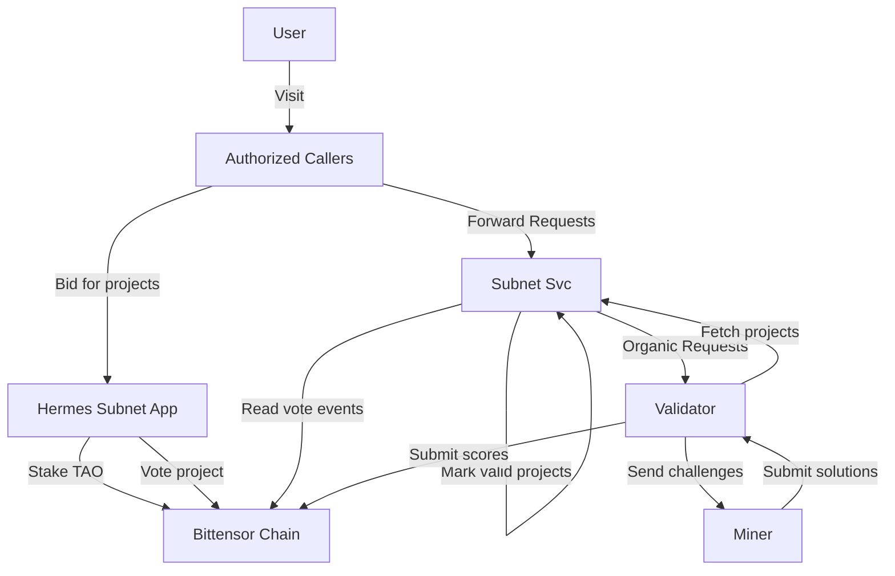
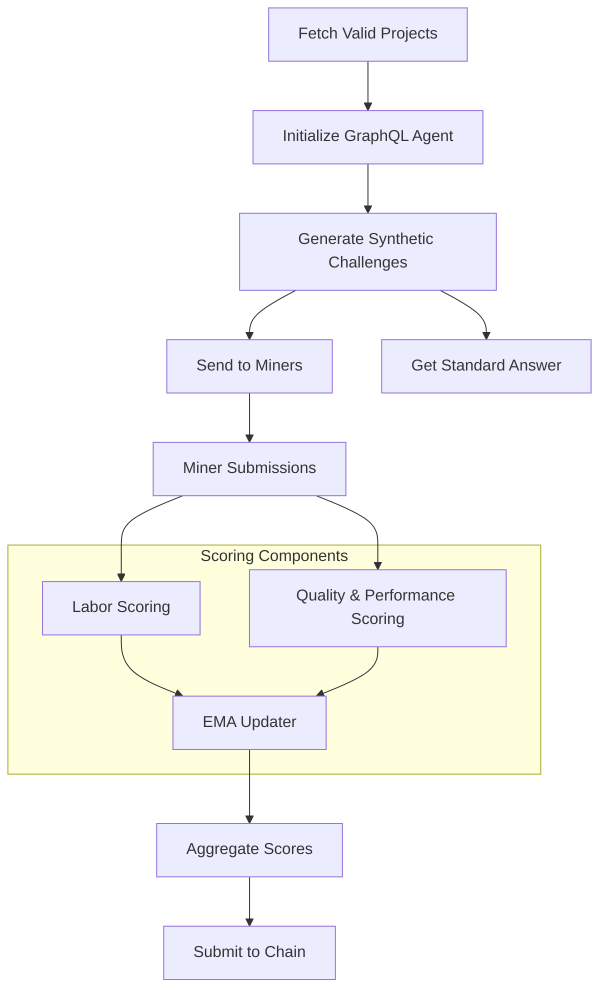
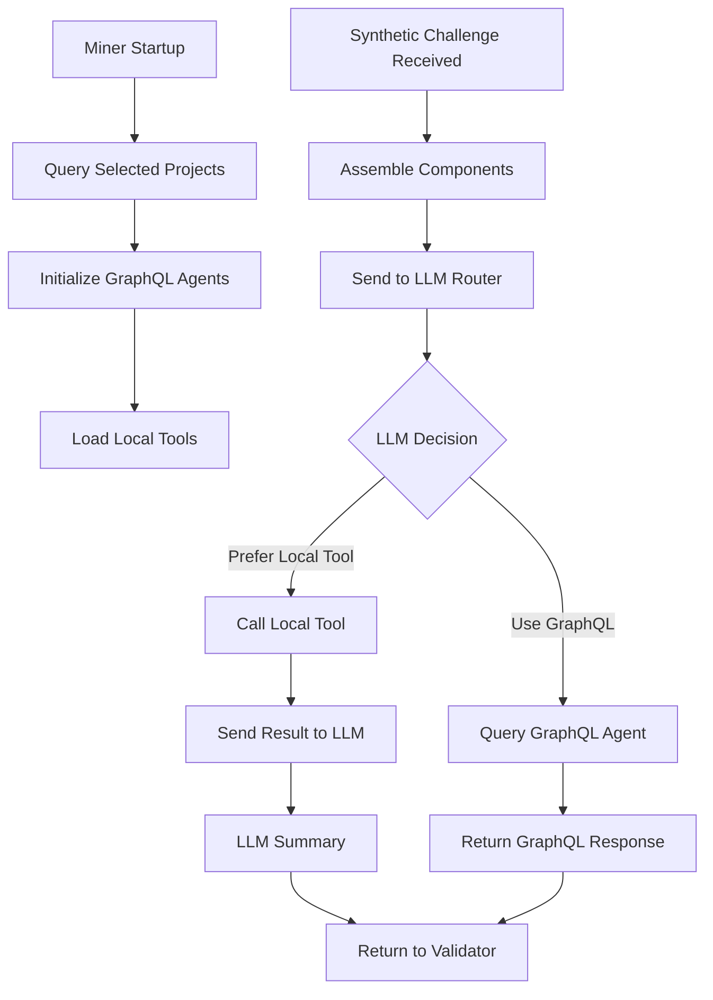

# SN SubQuery Hermes Litepaper

## Introduction

The SN SubQuery Hermes Subnet is a decentralized network designed to revolutionize how we access and process data. It creates a robust ecosystem of data indexers (Miners) and evaluators (Validators) built on the Bittensor framework.
The primary goal is to provide fast, accurate, and reliable graphql data query agent for subgraph and subquery projects.

## Problem Statement & Market Opportunity

The demand for reliable, performant, and decentralized access to blockchain data is exploding with the growth of dApps and complex smart contracts. Current solutions present significant trade-offs:
*   **Centralized Indexers & APIs:** Services like SubQuery's Managed Service or hosted subgraph endpoints create single points of failure, potential censorship, and introduce trust assumptions.
*   **Performance Inconsistency:** Query speeds and uptime can be unreliable, directly impacting user experience and dApp functionality.
*   **Fragmented Incentives:** High-quality, scalable data infrastructure is a public good that lacks a sustainable, market-driven incentive model for providers.

The SN SubQuery Hermes Subnet is built to solve these issues by creating a **decentralized marketplace for data querying**, where speed, accuracy, and uptime are directly rewarded by the network, ensuring a robust and competitive service layer for the entire Web3 ecosystem.

## High-Level Architecture

The Hermes Subnet's architecture is designed for scalability, security, and efficiency. It facilitates a seamless flow of information between users, applications, and the network's core components: Validators and Miners.

### Key Components:

*   **User:** Query Subgraph or Subquery data through authorized callers of the subnet.
*   **Authorized Callers:** Services like OnFinality AI Agent, and AskSubQuery.xyz that integrate with the subnet.
*   **Hermes Subnet App:** The main application for users and authorized callers to bid projects for subnet to optimise via stake TAO and vote.
*   **Validators:** Subnet participants, crucial nodes that generate challenges, evaluate Miner responses, and submit scores to the Bittensor chain.
*   **Miners:** The core of the network's infrastructure, responsible for processing challenges and providing data.
*   **Bittensor Chain:** The underlying blockchain that records all critical operations and the incentive mechanism to allow crowdsourced intelegence to emerge.

## The Validator's Role

Validators are the guardians of the Hermes Subnet. They are responsible for ensuring the quality and integrity of the data provided by Miners. Their primary functions include:

*   **Generating Synthetic Challenges:** Validators create synthetic challenges based on the schemas of real-world projects to test the capabilities of Miners.
*   **Evaluating Miner Performance:** They assess Miner responses for accuracy, speed, and quality.
*   **Scoring and Ranking:** Validators score Miners based on their performance and submit these scores to the Bittensor chain. here are two scores validators maintain:
    * A combined Score of Organic Challenge Labor Score and Synthetic Challenge Score for all subnet selected projects.
    * Synthetic Score per project: to decide the best performing miners for each project so it can be used for organic challenge routing.
*   **Enhancing Network Security:** By constantly evaluating Miners, Validators help to secure the network and ensure its reliability.

The following diagram illustrates the synthetic challenge process from the Validator's perspective:

## The Miner's Role

Miners are the workhorses of the Hermes Subnet. They are the final destination for all service requests and form the core infrastructure of the network. Their main responsibilities are:

*   **Responding to Synthetic Challenges:** Miners receive challenges from Validators and must respond with accurate and timely information.
*   **Optimizing Performance:** To maximize their rewards, Miners are incentivized to continuously optimize their response speed and factual accuracy. By
    *   **Wiring Custom Tools:** Miners can create custom tools to improve their performance and handle specific project requirements.
    *   **Train and Use Custom Model:** Miners can train and deploy custom LLMs to better handle the challenges posed by Validators.

The diagram below shows how a Miner processes a synthetic challenge:

## Tokenomics & Incentive Mechanism

The security and quality of the Hermes Subnet are driven by a carefully designed cryptoeconomic model based on the $TAO token.
- Network Token: The subnet operates on the Bittensor mainnet, using $TAO for all economic activities.
- Staking & Security:
    - Hermes Participates must stake $TAO to register on the network and in exchange to Subnet Alpha Token.
    - For Validators, their influence is weighted by their stake, aligning their economic interest with honest network oversight.
- Incentive Flow & Rewards:
    - The Bittensor protocol emits $TAO rewards to the Hermes subnet based on its inter-peer consensus – essentially, how well Validators agree on Miner rankings.
    - These rewards are distributed to Miners and Validators based on their performance scores. High-performing Miners receive a larger share of the emission.
    - Authorized Callers and end-users may, in future phases, pay query fees in $TAO or other tokens, creating a direct revenue stream for Miners beyond base emissions.
- Project Curation via Staking: The "Hermes Subnet App" allows $TAO holders to stake and vote on which data projects should be prioritized by the network, ensuring it serves the most valuable and demanded datasets.

## Roadmap
- Q1 2026: Launch
    - Launch on Bittensor mainnet.
    - Fine-tune scoring parameters and economic model.
- Q4 2025: Testnet & Incentivized Competition
    - Launch on Bittensor testnet.
    - Finalize subnet codebase and conduct internal testing.
    - Develop educational materials and documentation for participants.
    - Integration with key Authorized Callers (e.g., AskSubQuery.xyz).
- Q3 2025: Key Research & Development
    - Develop and test the dual scoring mechanism for synthetic and organic challenges.
    - Build and refine the GraphQL query agents for subgraph and subquery projects.
    - Design the initial economic model and staking mechanisms.
    
## Team & Advisors
The SN SubQuery Hermes project is spearheaded by a dedicated team with deep expertise in blockchain infrastructure, decentralized networks, and data engineering. Core contributors mainly are veterans from the SubQuery Network, supported by advisors specializing in cryptoeconomics and scalable systems.

## Conclusion & Vision
The SN SubQuery Hermes Subnet is more than a technical infrastructure project; it is an experiment in crowdsourcing intelligence for data accessibility.

By leveraging Bittensor's incentive machine, we aim to create a global, permissionless network that reliably serves the world's blockchain data.

Our vision is for Hermes to become the unseen, yet essential, backbone for a new generation of dApps—providing data with the speed of a centralized service, the robustness of a decentralized network, and the alignment of a free market. It could even incubate and create a specifically optimized LLM that performs the job quicker and more cost-effectively than any other existing solution.

We invite Miners, Validators, developers, and data consumers to join us in building this foundational layer for the decentralized future.
