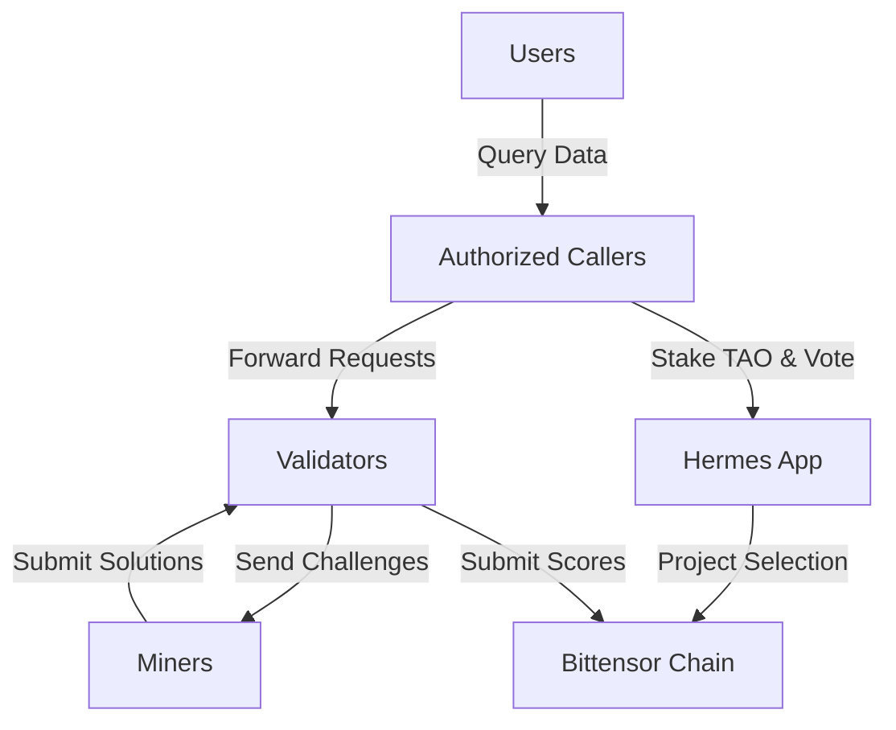

# SN-Hermes

**A Decentralized Network for Blockchain Data Querying**

[Website](https://subquery.network/hermes) • [Litepaper](https://github.com/SN-Hermes/.github/blob/main/profile/LITEPAPER.md) • [Discord](https://discord.gg/sn-hermes) • [Twitter](https://twitter.com/@HermesSubnet)

---

## Overview

SN-Hermes is a decentralized Bittensor subnet revolutionizing how we access and process blockchain data. We create a robust ecosystem of data indexers (**Miners**) and evaluators (**Validators**) built on the Bittensor framework.

Our mission is to provide **fast, accurate, and reliable** GraphQL data query agents for Subgraph and SubQuery projects—decentralized and censorship-resistant.

## Why SN-Hermes?

### The Problem

Current blockchain data indexing solutions face critical challenges:

- **Centralization:** Services like hosted subgraph endpoints create single points of failure and censorship risks
- **Performance Inconsistency:** Query speeds and uptime can be unreliable, impacting dApp functionality
- **Fragmented Incentives:** High-quality data infrastructure lacks sustainable, market-driven incentives

### Our Solution

SN-Hermes creates a **decentralized marketplace for data querying**, where:
- Speed, accuracy, and uptime are directly rewarded by the network
- Competitive market dynamics ensure robust service quality
- No single point of failure or censorship

## Architecture

### Key Components

| Component | Description |
|-----------|-------------|
| **Validators** | Generate synthetic challenges, evaluate miner performance, and submit scores to Bittensor chain |
| **Miners** | Process challenges, provide data, and optimize for speed and accuracy |
| **Authorized Callers** | Services integrating with the subnet (e.g., OnFinality AI Agent, AskSubQuery.xyz) |
| **Hermes Subnet App** | Staking and voting interface for project prioritization |

## How It Works

### For Validators
- Generate synthetic challenges based on real-world project schemas
- Evaluate miner responses for accuracy, speed, and quality
- Maintain scores for labor and quality/performance metrics
- Submit aggregated scores to Bittensor chain

### For Miners
- Receive and respond to synthetic challenges
- Wire custom tools for project-specific optimization
- Train and deploy custom LLMs for better performance
- Earn rewards based on ranking

## Tokenomics

SN-Hermes operates on the Bittensor mainnet using **$TAO** for all economic activities:

- **Staking:** Participants stake $TAO to register and receive subnet alpha tokens
- **Incentives:** $TAO rewards distributed based on performance scores
- **Project Curation:** Stake and vote on which data projects to prioritize

## Repositories

| Repository | Description | Language |
|------------|-------------|----------|
| [hermes-subnet](https://github.com/SN-Hermes/hermes-subnet) | Core subnet implementation with validator and miner logic |  |

## Roadmap

- **Q1 2026** - Key R&D: GraphQL query agents, dual scoring mechanism, economic model design
- **Q2 2026** - Testnet launch with incentivized competition
- **Q3 2026** - Mainnet launch on Bittensor

## Get Involved

We invite **Miners**, **Validators**, **developers**, and **data consumers** to join us in building this foundational layer for the decentralized future.

- **Run a Validator:** Help secure the network and evaluate miner performance
- **Run a Miner:** Provide data services and earn $TAO rewards
- **Build on Top:** Integrate your dApp with our decentralized query layer

## Team

SN-Hermes is spearheaded by veterans from the SubQuery Network, with deep expertise in blockchain infrastructure, decentralized networks, and data engineering.

---

**[Read the Litepaper](https://github.com/SN-Hermes/.github/blob/main/profile/LITEPAPER.md)** • **[Join Discord](https://discord.gg/sn-hermes)**

Built with [Bittensor](https://bittensor.com) • Powered by $TAO

